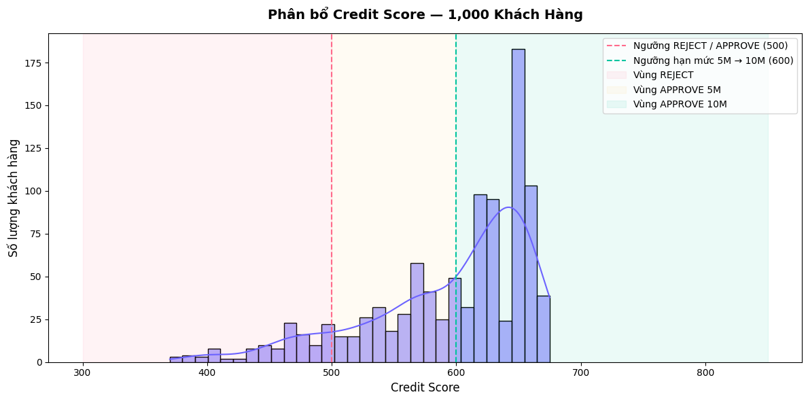
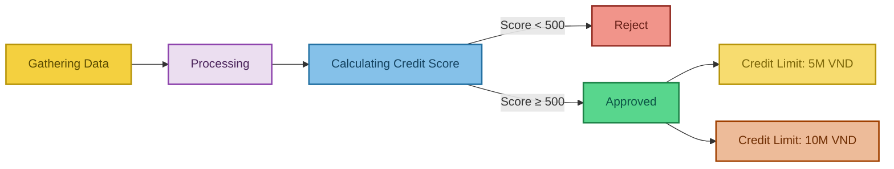

# 📊 Credit Scoring Engine & Risk Analytics Framework

## 📈 Key Risk Analytics & Insights
Đây là kết quả phân tích danh mục 1.000 khách hàng giả lập được trích xuất trực tiếp từ mô hình:



* **Tỷ lệ phê duyệt tối ưu:** Hệ thống tự động kiểm soát tỷ lệ duyệt ở mức **88.9%**, đảm bảo khả năng mở rộng tệp người dùng sành sỏi công nghệ mà không nới lỏng tiêu chuẩn an toàn.
* **Tương quan rủi ro rõ rệt:** Biểu đồ phân phối chứng minh hiệu quả hệ thống khi cô lập hoàn toàn nhóm khách hàng trễ hạn từ 3 lần trở lên vào phân khúc **REJECT** (Dải điểm dưới 500).

---

## 🧮 Risk Factor Scoring Framework (Bảng tra cứu điểm số)
Hệ thống vận hành dựa trên cơ chế chấm điểm động (Dynamic Scorecard) với thang điểm chuẩn từ **300 đến 850**
(Thang điểm này là thang comparable với benchmark của FICO và là thang được sử dụng rộng rãi trên thị trường):

| Tiêu chí phân tích | Khoảng giá trị (Bin) | Điểm cộng / trừ |
| :--- | :--- | :---: |
| **Thâm niên dùng Ví** | >= 24 tháng <br> 6 - 24 tháng <br> < 6 tháng | **+50** <br> **+20** <br> **-25** |
| **Lịch sử chậm thanh toán** | 0 lần <br> 1 lần <br> 2 lần <br> >= 3 lần | **+60** <br> **-20** <br> **-60** <br> **-120** |
| **Thói quen thanh toán Hóa đơn** | >=10 lần <br> >=6 lần <br> >=3 lần <br> Chưa đủ thông tin | **+30** <br> **+15** <br> **+5** <br> **+0** |
| **Tổng tiền giao dịch qua ví mỗi tháng** | >=10tr <br> >=3 <br> >=1tr <br> <1tr | **+35** <br> **+20** <br> **+0** <br> **-15** |

## 🐍 Python Highlight

```python
def make_credit_decision(score):
    if score >= 600:
        return 'APPROVE', '10,000,000 VND'
    elif score >= 500:
        return 'APPROVE', '5,000,000 VND'
    else:
        return 'REJECT', '0 VND'

# Áp dụng quyết định
df_customers[['Decision', 'Max_Limit']] = df_customers['Credit_Score'].apply(lambda s: pd.Series(make_credit_decision(s)))
df_customers.head()
```



## 💻 Tech Stack & Core Logic
* **Language:** Python (thực hiện bằng Google Colab)
* **Libraries:** `pandas` (Data simulation & manipulation), `matplotlib` & `seaborn` (Statistical visualization).
* **Decision Logic:**
  * Điểm >= 600: **APPROVE** | Hạn mức 10,000,000 VND
  * Điểm 500 - 599: **APPROVE** | Hạn mức 5,000,000 VND
  * Điểm < 500: **REJECT** | Hạn mức 0 VND
