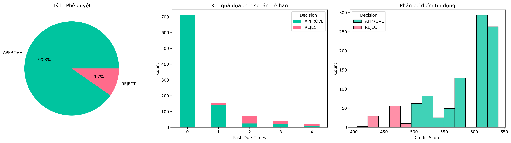

# 📊 Credit Scoring Engine & Risk Analytics Framework

Công cụ mô phỏng chấm điểm tín dụng tự động, dựa trên quy tắc được xây dựng hoàn toàn bằng Python để đánh giá rủi ro vỡ nợ của khách hàng bằng cách sử dụng các dữ liệu phi tài chính thay thế. 
---

## 📈 Key Risk Analytics & Insights
Đây là kết quả phân tích danh mục 1.000 khách hàng giả lập được trích xuất trực tiếp từ mô hình:



* **Tỷ lệ phê duyệt tối ưu:** Hệ thống tự động kiểm soát tỷ lệ duyệt ở mức **90.3%**, đảm bảo khả năng mở rộng tệp người dùng sành sỏi công nghệ mà không nới lỏng tiêu chuẩn an toàn.
* **Tương quan rủi ro rõ rệt:** Biểu đồ phân phối chứng minh hiệu quả hệ thống khi cô lập hoàn toàn nhóm khách hàng có lịch sử trễ hạn liên tục vượt mức (Past Due Times >= 2) vào phân khúc **REJECT** (Dải điểm dưới 500).

---

## 🧮 Core Scoring Matrix (Bảng tra cứu điểm số)
Hệ thống vận hành dựa trên cơ chế chấm điểm động (Dynamic Scorecard) với thang điểm chuẩn từ **300 đến 850**:

| Tiêu chí phân tích | Khoảng giá trị (Bin) | Điểm cộng / trừ |
| :--- | :--- | :---: |
| **Thâm niên dùng Ví** | >= 24 tháng <br> 6 - 24 tháng <br> < 6 tháng | **+50** <br> **+20** <br> **-15** |
| **Lịch sử chậm thanh toán** | 0 lần <br> 1 lần <br> >= 2 lần | **+60** <br> **-20** <br> **-80** |
| **Hóa đơn tiện ích (Điện/Nước)**| >= 1,000,000 VND <br> < 1,000,000 VND | **+30** <br> **0** |

## 🐍 Python Highlight

```python
# Scoring logic — Alternative Data Scorecard
def calculate_credit_score(wallet_tenure, payment_delays, utility_bill):
    base_score = 500
    
    # Wallet tenure scoring
    if wallet_tenure >= 24:
        score += 50
    elif wallet_tenure >= 6:
        score += 20
    else:
        score -= 15
    
    # Delinquency flag — hard penalty
    if payment_delays >= 2:
        score -= 80        # hard-reject trigger
    elif payment_delays == 1:
        score -= 20
    else:
        score += 60        # clean repayment history
    
    # Utility bill signal
    if utility_bill >= 1_000_000:
        score += 30
    
    return max(300, min(850, score))  # cap 300–850
```
---

## 💻 Tech Stack & Core Logic
* **Language:** Python (thực hiện bằng Google Colab)
* **Libraries:** `pandas` (Data simulation & manipulation), `matplotlib` & `seaborn` (Statistical visualization).
* **Decision Logic:** * Điểm >= 600: **APPROVE** | Hạn mức 10,000,000 VND
  * Điểm 500 - 599: **APPROVE** | Hạn mức 5,000,000 VND
  * Điểm < 500: **REJECT** | Hạn mức 0 VND
